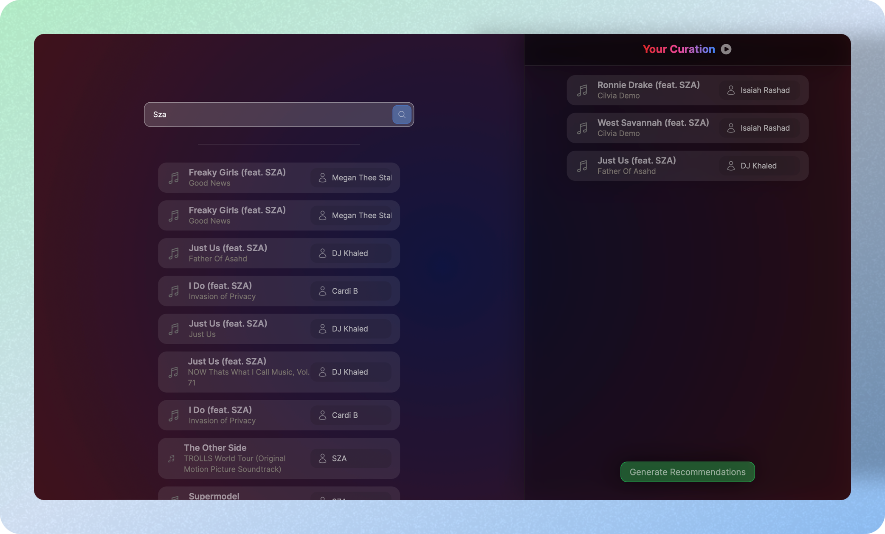

# Song Recommendations
The ultimate song curation and recommendation engine trained on 1.2 million songs from Spotify. Developed for our final project in Modern Databases at the University of Iowa.


<p align="center">
  
</p>

## Getting Started
The following steps will guide you through installation and deployment of the web application.

### Starting Services
We have included a docker-compose file for convenience which includes creation of containers for the Redis and Neo4J databases alongside the NextJS application. The NextJS container supports hot reloading when in development because it mounts the src/ directory to its file system. Please note, windows users are recommended to proceed with the following steps using `WSL`.

1. Install prerequisite software

   - [Docker Desktop](https://www.docker.com/products/docker-desktop/)
   - [NodeJS](https://nodejs.org/en)

2. Run `npm install`
3. Copy the `.env.example` file and rename it to `.env`
> **Note:** If you run into memory allocation issues in the Neo4J container, you may need to decrease `NEO4J_PAGECACHE_SIZE` and `NEO4J_HEAP_MAX_SIZE` variables in your *.env*
4. Run `npm run docker:up`


The song-recommendation application will be served at http://localhost:3000/. Likewise, you can access the Neo4J web interface through http://localhost:7474

### Seeding Data

After your services have been deployed you'll need to seed both the Redis and Neo4J database with the dataset we have used for this project. We are using the [Spotify 1.2 Million Songs](https://www.kaggle.com/datasets/rodolfofigueroa/spotify-12m-songs/) from Kaggle which must be downloaded before proceeding.

Once you have downloaded the dataset, make sure to update the environment variable pointing to the path it is stored on your device:
```sh
#############################
# Import Utility
#############################
DATA_PATH=/PATH/TO/tracks_features.csv
```

Afterwards, you can seed the data with the python script we have included. This script creates the entries for text search in Redis and creates the Song nodes in Neo4J, then also builds the TopK=15 similarity relations between these song nodes. Since the dataset is large in nature, expect this step to take a considerable amount of time (we found this to take anywhere between 10-20 minutes depending on your system)
```sh
npm run seed
```
Once data has been seeded successfully, you are all set to start playing around with the song recommendation interface!


## Directory Overview
- *src:*
  
   Code related to the NextJS website application

- *scripts:*
   
   Contains any bash or python scripts required for the project. This includes the neo4j & redis database seeding scripts.

- *volumes:*

   Volumes is where docker containers mount on your local file system. Redis & Neo4J data is stored here. This data should not be checked into version control.